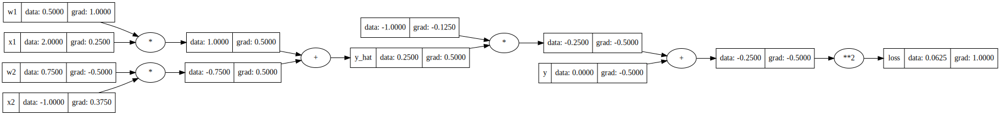
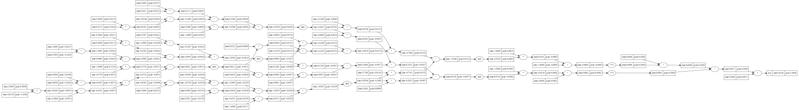

# Wichi

Wichi is a continuation of Andrej Karpathy's 
[Micrograd](https://github.com/karpathy/micrograd) package (following PyTorch 
conventions)— i.e. a simple reference implementation for an autograd engine.

# Installation

If you wish to create svg images of the resulting network graphs, install graphviz
(used by `wichi.utils.graphing`):

```commandline
apt install graphviz
```

Then install the package, either through a wheel or just installing the 
dependencies directly. I.e.

```commandline
git clone https://github.com/JeremyWurbs/autograd.git && cd autograd
```

Followed by one of the following:

```commandline
pip install -r requirements.txt
```

OR

```commandline
python setup.py bdist_wheel
pip install dist/wichi-1.0.0-py3-none-any.whl
```

# Understanding Autograd

To understand how autograd works at a high-level, it is recommended to take a 
look at PyTorch's 
[Autograd documentation](https://pytorch.org/tutorials/beginner/former_torchies/autograd_tutorial.html), 
which goes through the basics of creating and using Tensors able to unwind their
ops for gradient computations on a backwards pass.

Wichi is directly analogous to PyTorch. I.e. Wichi is built 
around the `Tensor` class. Tensors wrap a `.data` element, capturing any ops 
(e.g. summation, multiplication) on that
data to create a `_grad_fn()` method (again directly analogous to PyTorch's) 
for each op, which can subsequently be called in reverse order to compute 
gradients through the entire graph when any Tensor's `backward()` method is 
called.

For example, consider the following network, intuitively training a weight matrix, 
`W`, to better classify a batch of 32 MNIST images (each 28*28=784 pixels) 
according to a squared error loss (i.e. imagine `X` and `labels` have actual data):

```python 
import numpy as np
from wichi import Tensor

X = Tensor(np.random.randn(32, 784))
W = Tensor(np.random.randn(784, 1))
labels = Tensor(np.random.randn(32, 1))

Y = X @ W  # i.e. Y = X.__matmul__(W)
Z = Y.relu()
L = ((Z - labels)**2).sum()
```
which yields the following graph:


Looking at the graph, we see that our code has generated ten different tensors:
1. `X` (i.e. batch of 32 mnist images)
2. `Y` (i.e. batch of 32 mnist labels)
2. `W` (i.e. the weights we'd like to train)
4. `dot_product`
5. `Z`  (i.e. a standard perceptron)
5. `-1` (this Tensor is created from the fact that the minus operator is implemented by a "multiply by -1")
6. `-Y`
8. `losses`
9. `losses**2`
10. `L`

And used six different ops:
1. `@` (`.__matmul__()`)
2. `ReLU` (`.relu()`)
3. `+` (`.__add__()`)
4. `*` (`.__mul__()`)
5. `**2` (`.__pow__()`)
6. `.sum(dim=all)` (`.sum()`)

In order to train the network to better classify `X`, we need to compute $\frac{\partial L}{\partial W}$, 
which we can get through the chain rule:

```math
\frac{\partial L}{\partial W}  = \frac{\partial L}{\partial losses**2} \cdot \frac{\partial losses**2}{\partial losses} \cdot \frac{\partial losses}{\partial Z} \cdot \frac{\partial Z}{\partial Y} \cdot \frac{\partial Y}{\partial W}
```

The strategy for computing this gradient is as follows:
1. Set `L.grad` to `1`
2. Run `L.grad_fn` to compute $\frac{\partial L}{\partial losses**2}$ and store the result in `losses**2.grad`
3. Run `losses**2.grad_fn` to compute $\frac{\partial losses**2}{\partial losses}$ and store $\frac{\partial L}{\partial losses**2} \cdot \frac{\partial losses**2}{\partial losses}$ into `losses.grad`
4. Run `losses.grad_fn` to compute $\frac{\partial losses}{\partial Z}$ and store $\frac{\partial L}{\partial losses**2} \cdot \frac{\partial losses**2}{\partial losses} \cdot \frac{\partial losses}{\partial Z}$ into `Z.grad`
5. Run `Z.grad_fn` to compute $\frac{\partial Z}{\partial Y}$ and store $\frac{\partial L}{\partial losses**2} \cdot \frac{\partial losses**2}{\partial losses} \cdot \frac{\partial losses}{\partial Z} \cdot \frac{\partial Z}{\partial Y}$ into `dot_product.grad`
6. Run `dot_product.grad_fn` to compute $\frac{\partial Y}{\partial W}$ and store $\frac{\partial L}{\partial losses**2} \cdot \frac{\partial losses**2}{\partial losses} \cdot \frac{\partial losses}{\partial Z} \cdot \frac{\partial Z}{\partial Y} \cdot \frac{\partial Y}{\partial W}$ into `W.grad`
7. Set `W.data -= lr * W.grad`, for some learning rate `lr`.

For example, the `grad_fn` for `Y` (which computed `X @ W`) is generated as part 
of the `@` op (i.e. `X.__matmul__(W)`), and would look like:
```python 
def __matmul__(X, W):
    Y = Tensor(X.data * W.data)

    def _grad_fn():
        X.grad += Y.grad @ W.data.T
        Y.grad += X.data.T @ Y.grad
    Y._grad_fn = _grad_fn

    return Y
```

Note that this grad function actually has to compute 
$\frac{\partial Y}{\partial W}$ **and** $\frac{\partial Y}{\partial X}$, since
`__matmul__` is a binary operator and thus, in general, the gradients need to 
flow to both input Tensors.

# Usage Basics

You may create a network, run a forward and backward pass, and plot the resulting 
network graph with the following:

```python
from wichi import Tensor
from wichi.utils import draw_dot

x1 = Tensor(2.0, label='x1')
x2 = Tensor(-1.0, label='x2')
w1 = Tensor(0.5, label='w1')
w2 = Tensor(0.75, label='w2')
y = Tensor(0, label='y')

y_hat = w1*x1 + w2*x2; y_hat.label = 'y_hat'
loss = (y - y_hat) ** 2; loss.label = 'loss'

loss.backward()  # computes gradients
draw_dot(loss).render()
```

Which will yield the following diagram:



In addition, there is also the Modules module, which provides Neuron, Layer and
MLP classes to help create simple neural networks.

```python
from wichi import MLP, draw_dot

mlp = MLP(dim=[3, 4, 2])

x = [2.5, 0.5, -1.0]
y = [-1.0, 1.0]

y_hat = MLP(x)
loss = sum([(y - y_hat)**2 for y, y_hat in zip(y, y_hat)]) / 2

loss.backward()  # computes gradients
draw_dot(loss).render()
```

which will yield the following diagram:



As can be seen, the graphs can get quite large rather quickly. 

# Training

In order to train a network using Wichi, simply update any parameters according to
(some proportion of) their gradient. In pseudo-code:

```python
from wichi import MLP, DataModule  # E.g. MNIST

param = {'num_input': 784, 
         'hidden_dim_1': 20,
         'hidden_dim_2': 20,
         'num_output': 10,
         'max_epochs': 3,
         'loss_fn': MeanSquaredError(),
         'lr': 0.01}

mlp = MLP(dim=[num_input, hidden_dim_1, hidden_dim_2, num_output])
data = DataModule() 

for epoch in max_epochs:
    for x, y in data.next_training_batch():
        y_hat = mlp(x)
        loss = loss_fn(y, y_hat)
        
        loss.zero_grad()
        loss.backward()
        
        for p in mlp.parameters():
            p -= lr * p.grad
        
        print(f'loss: {loss}')
```

For an explicit training sample, refer to the 
[mnist_training.py](./scripts/mnist_training_deprecated.py)
sample, which initializes a Wichi network with the same weights as a torch model,
and then trains both side by side, showing that the Wichi autograd exactly
matches PyTorch's autograd.

# Testing

You can run the given unit tests, printing the resulting output, with

```commandline
pytest -s ./tests
```

which should output something similar to the following,

``` 
======================================= test session starts =========================================
platform linux -- Python 3.8.0, pytest-7.3.1, pluggy-1.0.0
rootdir: /home/jeremy/projects/autograd
collected 2 items                                                                                          

tests/test_value.py ..                                                                         [100%]
======================================== 2 passed in 1.37s ==========================================
```

