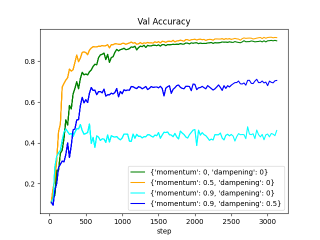

# Wichi

Wichi is a continuation of Andrej Karpathy's 
[Micrograd](https://github.com/karpathy/micrograd) package (following PyTorch 
conventions)— i.e. a simple reference implementation for an autograd engine.

# Installation

If you wish to create svg images of the resulting network graphs, install graphviz
(used by `wichi.utils.graphing`):

```commandline
apt install graphviz
```

Then install the package, either through a wheel or just installing the 
dependencies directly. I.e.

```commandline
git clone https://github.com/JeremyWurbs/autograd.git && cd autograd
```

Followed by one of the following:

```commandline
pip install -r requirements.txt
```

OR

```commandline
python setup.py bdist_wheel
pip install dist/wichi-1.0.0-py3-none-any.whl
```

# Understanding Autograd

To understand how autograd works at a high-level, it is recommended to take a 
look at PyTorch's 
[Autograd documentation](https://pytorch.org/tutorials/beginner/former_torchies/autograd_tutorial.html), 
which goes through the basics of creating and using Tensors able to unwind their
ops for gradient computations on a backwards pass.

For the most part, Wichi is directly analogous to PyTorch. That is, Wichi is 
built around the `Tensor` class. Tensors wrap a `.data` element and maintain an
analogous `.grad` element, which represents the gradient of some downstream 
Tensor with respect to the current wrapped Tensor. For all data ops that the 
Tensor class supports (e.g. summation, multiplication), each op is responsible 
for creating a `_grad_fn()` method, which can subsequently be called to compute 
the local partial derivative (i.e. the derivative of the current op) and for 
passing along the combined chained gradient to its parent Tensors (i.e. those 
Tensors which created it). 

At the end of this process, each parameter in the graph will have a gradient
(i.e. a value describing how changing it will change some further downstream
Tensor's value). Assuming we want the downstream value to go down (i.e. as
we would when minimizing a loss), it is clear we only need to subtract this 
`.grad` from the `.data` (usually modulo a learning rate) and voila— through 
the magic of backpropagation and autograd, your network will improve.

# Autograd by Example

Consider the following network, intuitively training a weight matrix, `W`, to 
better classify a batch of 32 MNIST images (each 28*28=784 pixels) according to 
a squared error loss (i.e. imagine `X` and `labels` have actual data):

```python 
import numpy as np
from wichi import Tensor

X = Tensor(np.random.randn(32, 784))  # input data
Y = Tensor(np.random.randn(32, 1))    # train labels
W = Tensor(np.random.randn(784, 1))   # weights to train

dot_product = X @ W     # i.e. dot_product = X.__matmul__(W)
Z = dot_product.relu()  # perceptron output
L = ((Z - Y)**2).sum()  # loss = sum squared loss
```
which yields the following graph:


Looking at the graph, we see that our code has generated ten different tensors:
1. `X` (i.e. batch of 32 mnist images)
2. `Y` (i.e. batch of 32 mnist labels)
3. `W` (i.e. the weights we'd like to train)
4. `dot_product`
5. `Z`  (i.e. a standard perceptron)
6. `-1` (this Tensor is created from the fact that the minus operator is implemented by a "multiply by -1")
7. `-Y`
8. `losses`
9. `losses_sqr`
10. `L`

And used six different ops:
1. `@` (`.__matmul__()`)
2. `ReLU` (`.relu()`)
3. `+` (`.__add__()`)
4. `*` (`.__mul__()`)
5. `**2` (`.__pow__()`)
6. `.sum(dim=all)` (`.sum()`)

The general strategy for training a network is to update its parameters 
(weights) in such a way that the loss will decrease. As our networks are
composed solely of differentiable functions, we can compute how changing 
our parameters will change the loss (i.e. $\frac{\partial L}{\partial W}$)
and use this gradient value to update our parameters. That is, we can 
update our parameters according to 
$W_{new} = W_{old} -lr * \frac{\partial L}{\partial W}$
for some learning rate constant `lr`. As generally `L` and `W` will have many
functions between them in the forward pass graph, we will need to use the chain 
rule to compute $\frac{\partial L}{\partial W}$. That is, by the chain rule, 
$\frac{\partial L}{\partial W}$ for our network above will be: 

```math
\frac{\partial L}{\partial W}  = \frac{\partial L}{\partial losses\_sqr} \cdot \frac{\partial losses\_sqr}{\partial losses} \cdot \frac{\partial losses}{\partial Z} \cdot \frac{\partial Z}{\partial dot\_product} \cdot \frac{\partial dot\_product}{\partial W}
```

The strategy for computing this gradient is as follows:
1. Set `L.grad` to `1`
2. Run `L.grad_fn` to compute $\frac{\partial L}{\partial losses\\_sqr}$ and store the result in `losses_sqr.grad`
3. Run `losses_sqr.grad_fn` to compute $\frac{\partial losses\\_sqr}{\partial losses}$ and store $\frac{\partial L}{\partial losses\\_sqr} \cdot \frac{\partial losses\\_sqr}{\partial losses}$ into `losses.grad`
4. Run `losses.grad_fn` to compute $\frac{\partial losses}{\partial Z}$ and store $\frac{\partial L}{\partial losses\\_sqr} \cdot \frac{\partial losses\\_sqr}{\partial losses} \cdot \frac{\partial losses}{\partial Z}$ into `Z.grad`
5. Run `Z.grad_fn` to compute $\frac{\partial Z}{\partial dot\\_product}$ and store $\frac{\partial L}{\partial losses\\_sqr} \cdot \frac{\partial losses\\_sqr}{\partial losses} \cdot \frac{\partial losses}{\partial Z} \cdot \frac{\partial Z}{\partial dot\\_product}$ into `dot_product.grad`
6. Run `dot_product.grad_fn` to compute $\frac{\partial dot\\_product}{\partial W}$ and store $\frac{\partial L}{\partial losses\\_sqr} \cdot \frac{\partial losses\\_sqr}{\partial losses} \cdot \frac{\partial losses}{\partial Z} \cdot \frac{\partial Z}{\partial dot\\_product} \cdot \frac{\partial dot\\_product}{\partial W}$ into `W.grad`
7. Set `W.data -= lr * W.grad`, for some learning rate `lr`.

For example, the `grad_fn` for the `dot_product` Tensor is generated as part 
of the `@` op (i.e. `X.__matmul__(W)`), and would be functionally identical to the following:
```python 
def __matmul__(X, W):
    dot_product = Tensor(X.data @ W.data)

    def _grad_fn():
        X.grad += dot_product.grad @ W.data.T
        W.grad += X.data.T @ dot_product.grad
    dot_product._grad_fn = _grad_fn

    return dot_product
```

Note that this grad function actually has to compute 
$\frac{\partial dot\\_product}{\partial W}$ **and** $\frac{\partial dot\\_product}{\partial X}$, since
`__matmul__` is a binary operator and thus, in general, the gradients need to 
flow to both input Tensors (even though in this case we do not need the `X.grad`).

For the backwards pass, each `._grad_fn()` must be called in the proper order. 
In order to create the backwards call order properly, each Tensor created by 
a Tensor op passes themselves as a child Tensor to this newly created Tensor. 
That is, the above pseudo-code for `X.__matmul__(W)` would start closer to:

```python 
def __matmul__(X, W):
    dot_product = Tensor(X.data @ W.data, _children=(X, W))
    ...
```

Notice the `_children=(X, W)` argument where we pass in the two input Tensors, 
and that *after* we compute the new (i.e. `dot_product's`) `_grad_fn()`, we are free
to call the `_grad_fn()` on the children (i.e. `W` and `X`). This fact is used to
dynamically construct a reverse computation graph by recursively adding the 
children tensors onto a sequential "tape". 

More, as the backward traversal path is not computed until a Tensor's `backward()` 
method is called, the forward graph is allowed to change dynamically from input 
to input (or batch to batch), and will also work for any number of losses or 
backwards gradients you may wish to compute and composite onto each other,
all done at run-time, anywhere in the entire computation graph— a rather 
powerful computational tool.

Explicitly, the backwards graph is computed at the start of the `backwards()` 
method:
```python
def backward(self):
    topo = list()
    visited = set()

    def build_topo(v):
        if v not in visited:
            visited.add(v)
            for child in v._prev:
                build_topo(child)
            topo.append(v)
    build_topo(self)
```

Which builds a sequential traversal path through the graph in `topo`, which is subsequently
traversed with:

```python 
    for node in reversed(topo):
        node._grad_fn()
```

# Usage Basics

You may create a network, run a forward and backward pass, and plot the resulting 
network graph with the following:

```python
from wichi import Tensor
from wichi.utils import draw_dot

x1 = Tensor(2., label='x1')
x2 = Tensor(-1., label='x2')
w1 = Tensor(0.5, label='w1')
w2 = Tensor(0.75, label='w2')
y = Tensor(0., label='y')

y_hat = w1*x1 + w2*x2; y_hat.label='y_hat'
loss = (y - y_hat) ** 2; loss.label = 'loss'

draw_dot(loss).render()
```

Which will yield the following diagram:


Notice that all of the gradients are still zero. In order to compute the gradients
we have to call `backward()` on a Tensor in the graph. I.e.:

```python
loss.backward()  # computes gradients
draw_dot(loss).render()
```


Now that the gradients have been filled in any parameter updates may happen as
discussed above.

## The nn Module

In addition, there is also the nn (neural networks) module, which provides Neuron, Layer and
MLP classes to help create simple neural networks.

```python
import numpy as np
from wichi import Tensor
from wichi.nn import MLP
from wichi.utils import draw_dot

mlp = MLP(dim=[784, 80, 20, 10])

x = Tensor(np.random.randn(32, 784), label='x')
y = Tensor(np.random.randn(32, 10), label='y')

y_hat = mlp(x)
loss = ((y - y_hat) ** 2).sum()

loss.backward()  # computes gradients
draw_dot(loss).render()
```

which will yield the following diagram:


# Training

In order to train a network using Wichi, simply update any parameters according to
(some proportion of) their gradient. In pseudo-code:

```python
from wichi import MLP, DataModule  # E.g. MNIST

param = {'num_input': 784, 
         'hidden_dims': [200, 80, 40],
         'num_output': 10,
         'max_epochs': 3,
         'loss_fn': MeanSquaredError(),
         'lr': 0.01}

mlp = MLP(dim=[num_input, *hidden_dims, num_output])
data = DataModule() 

for epoch in max_epochs:
    for x, y in data.next_training_batch():
        y_hat = mlp(x)
        loss = loss_fn(y, y_hat)
        
        mlp.zero_grad()
        loss.backward()
        
        for p in mlp.parameters():
            p -= lr * p.grad
        
        print(f'loss: {loss}')
```

Note that you can also use an explicit optimizer, directly analogous to Torch, 
if you prefer:

```python 
from wichi import MLP, DataModule  # E.g. MNIST

param = {'num_input': 784, 
         'hidden_dims': [200, 80, 40],
         'num_output': 10,
         'max_epochs': 3,
         'loss_fn': MeanSquaredError(),
         'lr': 0.01}

mlp = MLP(dim=[num_input, *hidden_dims, num_output])
optimizer = wichi.optim.SGD(mlp.parameters(), lr=lr)
data = DataModule() 

for epoch in max_epochs:
    for x, y in data.next_training_batch():
        y_hat = mlp(x)
        loss = loss_fn(y, y_hat)
        
        optimizer.zero_grad()
        loss.backward()
        optimizer.step()
                
        print(f'loss: {loss}')
```

For an explicit training sample, refer to the 
[mnist_training.py](./scripts/mnist_training_deprecated.py)
sample, which initializes a Wichi network with the same weights as a Torch model,
and then trains both side by side, asserting that the Wichi autograd exactly
matches PyTorch's autograd. Or if you wish to begin looking at the optimizer, 
refer to [optimizer_comparison.py](./scripts/optimizer_comparison.py), which 
initializes the same model each with their own optimizer. As expected, 
hyperparameters greatly affect training efficiency and convergence. Below we show
the result of an `optimizer_comparison.py` run using four different optimizers, 
each with different momentum hyperparamters.



# Testing

You can run the given unit tests, printing the resulting output, with

```commandline
pytest -s ./tests
```

which should output something similar to the following,

```commandline
============================================= test session starts =============================================
platform linux -- Python 3.8.0, pytest-7.3.1, pluggy-1.0.0
rootdir: /home/jeremy/projects/autograd
collected 4 items                                                                                                       

tests/test_tensor.py ..                                                                                 [ 50%]
tests/test_value.py ..                                                                                  [100%]
============================================== 4 passed in 0.99s ==============================================
```
